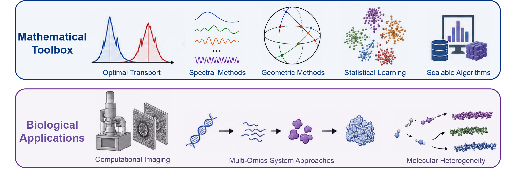

---

I am currently a Global Science Scholar supported by the Chan Zuckerberg Biohub Network (CZ Biohub Network) and the Stellar Science Foundation [(SS-F)](https://ss-f.org/en/homepage-en/), and am hosted by [Dr. Nozomu Yachie](https://yachie-lab.org/?lang=EN) at The University of Osaka.

Previously I was a DataX Postdoctoral Research Associate in the Program for Applied and Computational Mathematics [(PACM)](https://www.pacm.princeton.edu/) and Center for Statistics and Machine Learning [(CSML)](https://csml.princeton.edu/) at Princeton University in the group of [Dr. Amit Singer](https://web.math.princeton.edu/~amits/). My research interests broadly include the mathematics of data science and signal processing. In particular I focus on developing metrics and algorithms with solid mathematical foundations that can be applied to imaging techniques like cryogenic electron microscopy (cryo-EM).

Prior to joining PACM, I obtained a B.S. in Chemical and Biological Engineering from the University of Colorado at Boulder and a PhD in Biochemistry at the University of Texas at Austin. During my PhD, I developed experimental and computational methods to establish a data-driven approach to structural biology by combining large multi-modal datasets. My PhD advisors were [Dr. Edward Marcotte](http://www.marcottelab.org/index.php/Main_Page) and [Dr. David Taylor](https://davidtaylorlab.com/). 

<!--   -->

  

### Research Interests
---
- Mathematics of data science
- Signal processing
- Optimal transport
- Computational imaging
- Cryo-EM
- Systems biology

 

If you are interested in collaborating or have questions about my research, please feel free to contact me

### Contact
---

ericverbeke73[at]gmail.com
