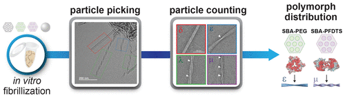

------

  

### [Structural Biology in the Multi-Omics Era](https://pubs.acs.org/doi/abs/10.1021/acs.jcim.9b01164)  
CL McCafferty, ***EJ Verbeke***, EM Marcotte, DW Taylor  

*Journal of Chemical Information and Modeling*

 

------

  

### [Functionalized Mesoporous Silicas Direct Structural Polymorphism of Amyloid-β Fibrils](https://pubs.acs.org/doi/abs/10.1021/acs.langmuir.0c00827)  
MJ Lucas\*, H Pan\*, ***EJ Verbeke****, LJ Webb, DW Taylor, BK Keitz  

*Langmuir*

 

------

  

### [Separating distinct structures of multiple macromolecular assemblies from cryo-EM projections](https://doi.org/10.1016/j.jsb.2019.107416)  
***EJ Verbeke***, Y Zhou, AP Horton, AL Mallam, DW Taylor, EM Marcotte  

*Journal of Structural Biology*  

  

 
------

  

### [Electron microscopy snapshots of single particles from single cells](https://www.jbc.org/content/294/5/1602.short)  
X Yi\*, ***EJ Verbeke****, Y Chang\*, DJ Dickinson, DW Taylor  
*Journal of Biological Chemistry*

 

------

  

### [Classification of single particles from human cell extract reveals distinct structures](https://doi.org/10.1016/j.celrep.2018.06.022)  
***EJ Verbeke***, AL Mallam, K Drew, EM Marcotte, DW Taylor  
*Cell Reports*  

 

------

  

### [Molecular determinants of tubulin’s C-terminal tail conformational ensemble](https://doi.org/10.1021/acschembio.6b00507)  
KP Wall, M Pagratis, G Armstrong, JL Balsbaugh, ***EJ Verbeke***, CG Pearson, LE Hough  
*ACS Chemical Biology*  

 

------
