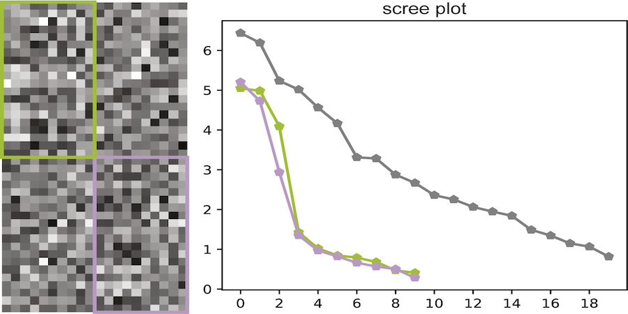

See my [Google Scholar](https://scholar.google.com/citations?user=0jB6ICsAAAAJ&hl=en) page

------

  

### [Algebraic constraints and algorithms for common lines in cryo-EM](https://doi.org/10.1017/S2633903X24000072)
T Muller, A Duncan, ***EJ Verbeke***, J Kileel

*Biological Imaging, 2024*

 

------

  

### [Moment-based metrics for molecules computable from cryogenic electron microscopy images](https://doi.org/10.1017/S2633903X24000023)
A Zhang, O Mickelin, J Kileel, ***EJ Verbeke***, NF Marshall, M Gilles, A Singer

*Biological Imaging, 2024*

 

------

  

### [Self Fourier shell correlation: properties and application to cryo-ET](https://doi.org/10.1038/s42003-023-05724-y)  
***EJ Verbeke***, M Gilles, T Bendory, A Singer 

*Communications Biology, 2024*

 

------

  

### [The Protein Organization of a red blood cell](https://doi.org/10.1016/j.celrep.2022.111103)  
W Sae-Lee, CL McCafferty, ***EJ Verbeke***, PC Havugimana, O Papoulas, CD McWhite, JR Houser, K Vanuytsel, GJ Murphy, K Drew, A Emili , DW Taylor, EM Marcotte 

*Cell Reports, 2022*

 

------

  

### [Cross-Seeding Controls Aβ Fibril Populations and Resulting Functions](https://pubs.acs.org/doi/full/10.1021/acs.jpcb.1c09995)  
MJ Lucas, HS Pan, ***EJ Verbeke***, G Partipilo, EC Helfman, L Kann, BK Keitz, DW Taylor, LJ Webb

*Journal of Physical Chemistry B, 2022*

 

------

  

### [Structural Biology in the Multi-Omics Era](https://pubs.acs.org/doi/abs/10.1021/acs.jcim.9b01164)  
CL McCafferty, ***EJ Verbeke***, EM Marcotte, DW Taylor  

*Journal of Chemical Information and Modeling, 2020*

 

------

  

### [Functionalized Mesoporous Silicas Direct Structural Polymorphism of Amyloid-β Fibrils](https://pubs.acs.org/doi/abs/10.1021/acs.langmuir.0c00827)  
MJ Lucas\*, H Pan\*, ***EJ Verbeke****, LJ Webb, DW Taylor, BK Keitz  

*Langmuir, 2020*

 

------

  

### [Separating distinct structures of multiple macromolecular assemblies from cryo-EM projections](https://doi.org/10.1016/j.jsb.2019.107416)  
***EJ Verbeke***, Y Zhou, AP Horton, AL Mallam, DW Taylor, EM Marcotte  

*Journal of Structural Biology, 2020*  

 

 
------

  

### [Electron microscopy snapshots of single particles from single cells](https://www.jbc.org/content/294/5/1602.short)  
X Yi\*, ***EJ Verbeke****, Y Chang\*, DJ Dickinson, DW Taylor

*Journal of Biological Chemistry, 2019*

 

------

  

### [Classification of single particles from human cell extract reveals distinct structures](https://doi.org/10.1016/j.celrep.2018.06.022)  
***EJ Verbeke***, AL Mallam, K Drew, EM Marcotte, DW Taylor  

*Cell Reports, 2018*  

 

------

  

### [Molecular determinants of tubulin’s C-terminal tail conformational ensemble](https://doi.org/10.1021/acschembio.6b00507)  
KP Wall, M Pagratis, G Armstrong, JL Balsbaugh, ***EJ Verbeke***, CG Pearson, LE Hough  

*ACS Chemical Biology, 2016*  

 

------
